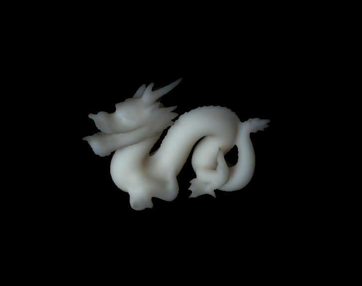

FastTranslucentShader
===

> Fast translucent object rendering with GLSL. This program is an implementation of the paper, "Real-time rendering of deformable heterogeneous translucent objects using multiresolution splatting".

## Build

This program can be easily build with CMake v3.0.0 or higher. The dependencies of this project is listed below.

* OpenCV 3.x
* Qt 5.x

After preparing above dependencies, you can build the progam by typing the following commands.

```shell
$ git clone https://qithub.com/tatsy/FastTranslucentShader.git
$ mkdir build
$ cd build
$ cmake [-D QT5_ROOT=(Your Qt folder) -D OpenCV_DIR=(Your OpenCV folder)] ..
$ cmake --build .
```

If you prefer to use CMake GUI, please specify "QT5_ROOT" and "OpenCV_DIR" properties with your GUI.

## Screen shot



## License

MIT License 2016 (c) Tatsuya Yatagawa (tatsy).
